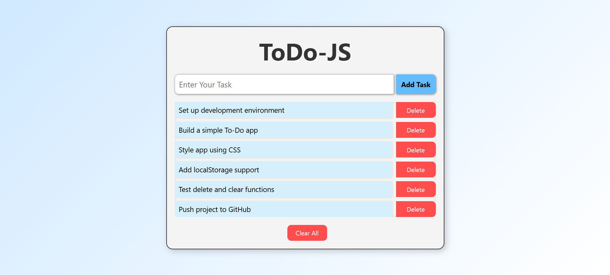

# 📝 Task Manager Web App

A simple and responsive **task manager** built using **HTML, CSS, and JavaScript**, with support for **localStorage** to persist tasks even after page reload.

## 🚀 Features

- ✅ Add new tasks
- 🗑️ Delete individual tasks
- 🧹 Clear all tasks at once
- 💾 Tasks are saved in `localStorage`
- 🚫 Prevents empty and duplicate entries
- 🎯 Keyboard support (`Enter` key to add task)

## 📷 Screenshot

## 💻 Demo

[Click to View Live](https://shivampisal.github.io/ToDo-JS/) 

## 🛠️ Tech Stack

- **HTML5**
- **CSS3**
- **JavaScript**
- **LocalStorage API**

## 📂 Project Structure

- **No build tools or servers needed — it's 100% frontend!**

🌟 To-Do / Improvements
 - Add dark mode toggle 🌙
 - Allow editing tasks ✏️
 - Add "mark as complete" feature ☑️
 - Export/import task list 📤📥

📄 License
This project is open source and available under the MIT License.

Made with ❤️ by Shivam Pisal
